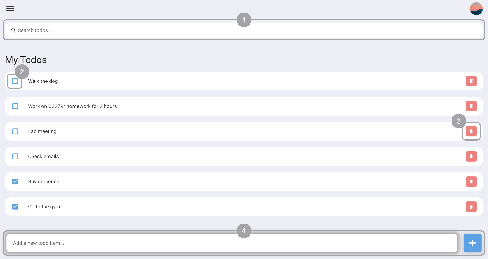

# todo3
Todo app made with Flutter: [https://catherinesyeh.github.io/todo3/](https://catherinesyeh.github.io/todo3/)

## instructions
Open [webpage](https://catherinesyeh.github.io/todo3/) to start exploring. The app comes preloaded with a few todo items as an example.



*Try these features out!*
1. Search/filter existing todos with the search bar at the top of the page
2. Check/uncheck off a todo by clicking on its checkbox
3. Remove a todo by pressing the trashcan icon to the right of each item
4. Type a todo into the input box at the bottom of the page and press the ```+``` button to add it to the list

## resources
I followed this [YouTube tutorial](https://www.youtube.com/watch?v=K4P5DZ9TRns&ab_channel=PradipDebnath) to build my todo app, making modifications accordingly.

## other notes
The full code (and my comments) that was used to create this flutter todo app is located in the [flutter_todo_app](flutter_todo_app) directory. The files currently located at the root were generated from running the ```flutter build web``` command.
